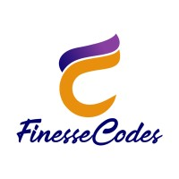
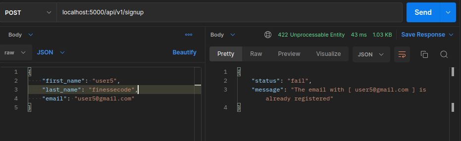
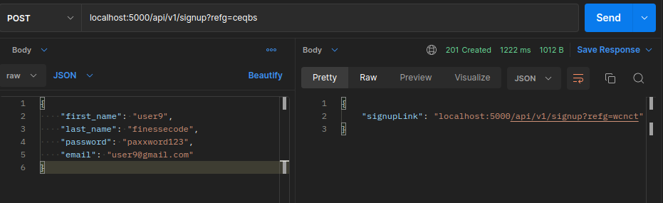

# Social Media Campaign Platform API

<br />
<p align="center">
  <a https://www.finessecodes.com/">
    
  </a>
</p>
This API is built with Nodejs. The social media campaign api provides participants a platform to signup and stand a chance to enter the competition. Anybody can participate by signingup on the platform and then shares the signup link. Each person that registers using your signup link, Your competition entry increases. The top 10 participants with the highest entries wins. ;

Types of Users

- Participants
- Admin

A participant can register on the platform using the following details;

- Name( first and last name)
- Email
- Mobile Number

The General Notice board allows everyone

- To see the top 10 participants.
- To see the people each participant referred.

### Built With

- [Nodejs](https://nodejs.org/en/)
- [Expressjs](https://expressjs.com)
- [Mongodb](https://sendgrid.com)

<!-- GETTING STARTED -->

## Getting Started

To get started setting up this project locally. Please kindly follow this steps to get a local copy up and running on your machine.

### Prerequisites

This are list of things you need to need to get installed.

- npm
  ```sh
  npm install npm@latest -g
  ```

### Installation

1. Fork the repo
   ```sh
   git clone https://github.com/udofia2/social-media-campaign-platform.git
   ```
2. Install NPM packages

   ```sh
   npm install
   ```

3. To start development server
   ```sh
   npm run dev
   ```

## Usage

This project can be tested using postman, insomnia etc.

\_For more examples, please refer to the [Documentation](https://documenter.getpostman.com/view/7592361/2s8YemtZ88)

## Contributing

Contributions are what make the open source community such an amazing place to be learn, inspire, and create. Any contributions you make are **greatly appreciated**.

1. Fork the Project
2. Create your Feature Branch (`git checkout -b feature/AmazingFeature`)
3. Commit your Changes (`git commit -m 'Added some AmazingFeature'`)
4. Push to the Branch (`git push origin feature/AmazingFeature`)
5. Open a Pull Request

## License

Distributed under the MIT License. See `LICENSE` for more information.

## Contact

UDOFIA ABASIODONG - Portfolio: [Odiong](https://udofia.herokuapp.com) - [udofia Portfolio](https://udofia.herokuapp.com)

Project Link: [https://github.com/udofia2/social-media-campaign-platform](https://github.com/udofia2/social-media-campaign-platform)

Documentation: [Documentation](https://documenter.getpostman.com/view/7592361/2s8YemtZ88)

## ScreenShoots

Users are allow only one registration for each email


Succefull registration with referral link

